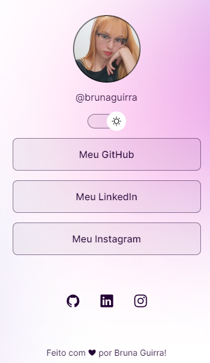

<h1 align="center"> DevLinks </h1>

 

## 🚀 Tecnologias

Esse projeto foi desenvolvido com as seguintes tecnologias:

- HTML e CSS
- JavaScript
- Git e Github
- Figma

 
 
## 💻 Projeto

O DevLinks é um agregador de links para usar como cartão de visitas online.

 

## 🔖 Layout

  
  

---

Feito com ♥ by Bruna Guirra

---

Esse projeto está sob a licença MIT. E os devidos créditos pertencem à <a href="https://www.rocketseat.com.br/" target="_blank">Rocketseat</a>.

